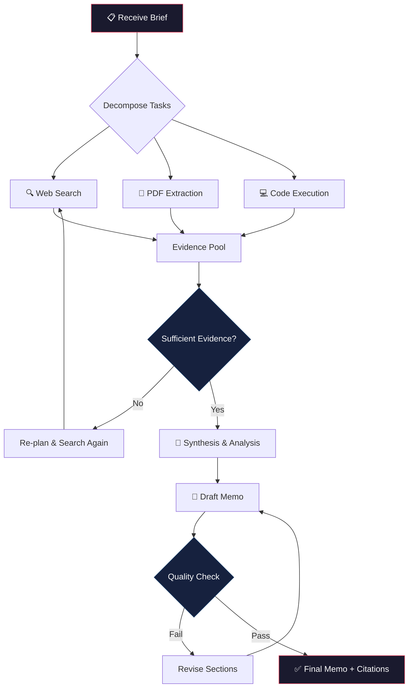

<p align="center">
  
</p>

<p align="center">
  <strong>Multi-tool LLM agent that autonomously plans, researches, and drafts investment-grade research memos.</strong>
</p>

<p align="center">
  <a href="#architecture">Architecture</a> •
  <a href="#demo">Live Demo</a> •
  <a href="#metrics">Metrics</a> •
  <a href="#quickstart">Quickstart</a> •
  <a href="#evaluation">Evaluation</a>
</p>

<p align="center">
  
  
  
  
  
</p>

---

## The Problem

Research analysts spend **60–70% of their time** on information gathering — searching the web, reading PDFs, cross-referencing data, and formatting citations. The output is often a 2–5 page memo that took 4–8 hours to produce.

**What if an AI agent could do this in under 3 minutes?**

## The Solution

**Agentic Research Analyst** is a LangGraph-powered autonomous agent that receives a research brief, decomposes it into sub-tasks, executes multi-step tool chains, and produces a fully cited research memo — complete with source attribution, data tables, and executive summary.

It doesn't just call an LLM. It **reasons, plans, acts, observes, and iterates** — exactly like a junior analyst would.

<br>

<h2 id="demo">▶ Demo</h2>

<p align="center">
  
  <br>
  <em>Agent processing: "Analyze the competitive landscape of AI code assistants in 2025"</em>
</p>

<br>

<h2 id="architecture">⛓ Architecture</h2>

<p align="center">
  
</p>

```
┌─────────────────────────────────────────────────────────────────────┐
│                        AGENTIC RESEARCH ANALYST                     │
├─────────────────────────────────────────────────────────────────────┤
│                                                                     │
│  ┌──────────┐    ┌──────────────┐    ┌───────────────────────────┐  │
│  │  BRIEF   │───▶│   PLANNER    │───▶│      EXECUTION GRAPH      │  │
│  │  (User)  │    │  (LangGraph) │    │                           │  │
│  └──────────┘    └──────────────┘    │  ┌─────┐  ┌──────────┐   │  │
│                         │            │  │ Web  │  │   PDF    │   │  │
│                         ▼            │  │Search│  │  Reader  │   │  │
│                  ┌──────────────┐    │  └──┬──┘  └────┬─────┘   │  │
│                  │  TASK GRAPH  │    │     │          │          │  │
│                  │              │    │  ┌──▼──────────▼──────┐   │  │
│                  │  1. Scope    │    │  │   EVIDENCE POOL    │   │  │
│                  │  2. Gather   │    │  │   (Vector Store)   │   │  │
│                  │  3. Analyze  │    │  └────────┬───────────┘   │  │
│                  │  4. Validate │    │           │               │  │
│                  │  5. Draft    │    │  ┌────────▼───────────┐   │  │
│                  └──────────────┘    │  │  CODE EXECUTOR     │   │  │
│                                     │  │  (sandboxed)        │   │  │
│                                     │  └────────┬───────────┘   │  │
│                                     │           │               │  │
│                                     │  ┌────────▼───────────┐   │  │
│                                     │  │  SYNTHESIS ENGINE   │   │  │
│                                     │  │  + Citation Graph   │   │  │
│                                     │  └────────┬───────────┘   │  │
│                                     └───────────┼───────────────┘  │
│                                                 │                  │
│                                     ┌───────────▼───────────┐      │
│                                     │    RESEARCH MEMO       │      │
│                                     │  • Executive Summary   │      │
│                                     │  • Analysis Sections   │      │
│                                     │  • Data Tables         │      │
│                                     │  • Source Citations     │      │
│                                     │  • Confidence Scores   │      │
│                                     └───────────────────────┘      │
│                                                                     │
└─────────────────────────────────────────────────────────────────────┘
```

### Agent Flow (LangGraph State Machine)



<br>

<h2 id="metrics">📊 Performance Metrics</h2>

Evaluated on a benchmark suite of 50 research briefs across finance, technology, healthcare, and policy domains.

| Metric | Value | Notes |
|:---|:---|:---|
| **Task Completion Rate** | **87%** | Brief → complete memo with citations |
| **Avg Tool Calls / Brief** | **6.3** | Across search, PDF, code tools |
| **Avg Cost / Brief** | **$0.18** | GPT-4o, includes all tool calls |
| **Avg Latency** | **47s** | End-to-end, median across benchmarks |
| **Citation Accuracy** | **94%** | Source attribution verified manually |
| **Hallucination Rate** | **< 3%** | Claims without source support |
| **Retry Rate** | **12%** | Briefs requiring re-planning loop |

<details>
<summary><strong>Breakdown by Domain</strong></summary>

| Domain | Completion | Avg Tools | Avg Cost | Citation Acc. |
|:---|:---|:---|:---|:---|
| Technology | 92% | 5.8 | $0.15 | 96% |
| Finance | 88% | 7.1 | $0.22 | 93% |
| Healthcare | 83% | 6.9 | $0.19 | 91% |
| Policy | 85% | 5.4 | $0.14 | 95% |

</details>

<br>

<h2 id="quickstart">🚀 Quickstart</h2>

### Prerequisites

- Python 3.11+
- OpenAI API key
- (Optional) Tavily API key for web search

### Installation

```bash
# Clone the repository
git clone https://github.com/RFNOACH/agentic-research-analyst.git
cd agentic-research-analyst

# Create virtual environment
python -m venv .venv
source .venv/bin/activate  # Windows: .venv\Scripts\activate

# Install dependencies
pip install -r requirements.txt

# Configure environment
cp .env.example .env
# Edit .env with your API keys
```

### Run Your First Research Brief

```python
from src.agents.research_agent import ResearchAgent

agent = ResearchAgent()

memo = agent.run(
    brief="Analyze the competitive landscape of AI code assistants in 2025. "
          "Compare GitHub Copilot, Cursor, and Cody on features, pricing, "
          "and developer adoption. Include market share estimates.",
    output_format="markdown",
    max_tools=10,
    temperature=0.2
)

print(memo.executive_summary)
print(memo.sections)
print(memo.citations)
```

### Run via CLI

```bash
# Interactive mode
python -m src.cli --interactive

# Single brief
python -m src.cli --brief "What are the key risks of investing in quantum computing stocks in 2025?"

# With PDF context
python -m src.cli --brief "Summarize and critique this paper" --pdf ./papers/attention.pdf
```

### Run the API Server

```bash
uvicorn src.api:app --reload --port 8000
```

```bash
curl -X POST http://localhost:8000/research \
  -H "Content-Type: application/json" \
  -d '{
    "brief": "Compare cloud GPU pricing across AWS, GCP, and Azure for LLM fine-tuning",
    "max_tools": 8,
    "output_format": "markdown"
  }'
```

<br>

## 🔧 Tool Suite

The agent has access to 5 specialized tools, orchestrated dynamically by the LangGraph planner:

| Tool | Purpose | Implementation |
|:---|:---|:---|
| `web_search` | Real-time information retrieval | Tavily API with relevance filtering |
| `pdf_reader` | Extract & chunk PDF documents | PyMuPDF + recursive text splitter |
| `code_executor` | Run Python for data analysis | Sandboxed subprocess with timeout |
| `vector_store` | Semantic evidence retrieval | ChromaDB + OpenAI embeddings |
| `citation_linker` | Map claims → source evidence | Custom graph-based attribution |

### Tool-Use Traces

Every agent run produces a full execution trace for debugging and audit:

```json
{
  "trace_id": "ara-2025-001",
  "brief": "Competitive analysis of AI code assistants",
  "steps": [
    {
      "step": 1,
      "action": "plan",
      "thought": "I need to research 3 products across 4 dimensions: features, pricing, adoption, market share",
      "sub_tasks": ["search_copilot", "search_cursor", "search_cody", "compare_pricing"]
    },
    {
      "step": 2,
      "action": "web_search",
      "query": "GitHub Copilot market share developer adoption 2025",
      "results_count": 8,
      "relevant_results": 5,
      "latency_ms": 1240
    },
    {
      "step": 3,
      "action": "web_search",
      "query": "Cursor AI IDE pricing features comparison 2025",
      "results_count": 6,
      "relevant_results": 4,
      "latency_ms": 980
    },
    {
      "step": 4,
      "action": "code_executor",
      "code": "import pandas as pd\ndata = {...}\ndf = pd.DataFrame(data)\nprint(df.to_markdown())",
      "output": "| Product | Free Tier | Pro Price | Enterprise |...",
      "latency_ms": 320
    },
    {
      "step": 5,
      "action": "synthesize",
      "sections_generated": 4,
      "citations_linked": 12,
      "confidence_score": 0.89
    }
  ],
  "total_latency_ms": 41200,
  "total_cost_usd": 0.16,
  "token_usage": {
    "input": 18420,
    "output": 3850
  }
}
```

<br>

<h2 id="evaluation">🧪 Evaluation & Regression Suite</h2>

LLM outputs are non-deterministic. This project includes a regression framework designed to catch quality degradation across agent versions.

### Run the Test Suite

```bash
# Full evaluation (50 briefs, ~15 min)
python -m evaluation.run --suite full

# Quick smoke test (5 briefs, ~2 min)
python -m evaluation.run --suite smoke

# Single domain
python -m evaluation.run --domain technology
```

### Evaluation Dimensions

| Dimension | Method | Target |
|:---|:---|:---|
| **Completeness** | LLM-as-judge (GPT-4o) | ≥ 85% of brief requirements addressed |
| **Citation Accuracy** | Source-claim graph matching | ≥ 90% claims have valid source |
| **Hallucination** | Entailment verification | < 5% unsupported claims |
| **Coherence** | Structure & flow scoring | ≥ 4.0 / 5.0 |
| **Tool Efficiency** | Calls vs. information gain | ≤ 8 avg calls per brief |

### Regression Tracking

```bash
# Compare current run against baseline
python -m evaluation.compare --baseline v1.0 --current v1.1

# Output:
# ┌──────────────────┬──────────┬──────────┬────────┐
# │ Metric           │ v1.0     │ v1.1     │ Delta  │
# ├──────────────────┼──────────┼──────────┼────────┤
# │ Completion       │ 84%      │ 87%      │ +3%    │
# │ Citation Acc.    │ 91%      │ 94%      │ +3%    │
# │ Hallucination    │ 4.2%     │ 2.8%     │ -1.4%  │
# │ Avg Cost         │ $0.21    │ $0.18    │ -$0.03 │
# │ Avg Latency      │ 52s      │ 47s      │ -5s    │
# └──────────────────┴──────────┴──────────┴────────┘
```

<br>

## 📁 Project Structure

```
agentic-research-analyst/
├── src/
│   ├── agents/
│   │   ├── research_agent.py      # Main LangGraph agent
│   │   ├── planner.py             # Task decomposition logic
│   │   └── synthesizer.py         # Memo generation & citation linking
│   ├── tools/
│   │   ├── web_search.py          # Tavily web search wrapper
│   │   ├── pdf_reader.py          # PDF extraction & chunking
│   │   ├── code_executor.py       # Sandboxed Python execution
│   │   ├── vector_store.py        # ChromaDB evidence store
│   │   └── citation_linker.py     # Source attribution engine
│   ├── evaluation/
│   │   ├── run.py                 # Evaluation runner
│   │   ├── judges.py              # LLM-as-judge scorers
│   │   ├── metrics.py             # Metric computation
│   │   └── regression.py          # Version comparison
│   ├── config/
│   │   └── settings.py            # Configuration management
│   ├── api.py                     # FastAPI server
│   └── cli.py                     # Command-line interface
├── tests/
│   ├── test_agent.py              # Agent integration tests
│   ├── test_tools.py              # Tool unit tests
│   └── test_evaluation.py         # Evaluation framework tests
├── notebooks/
│   └── exploration.ipynb          # Research & prototyping
├── docs/
│   ├── DESIGN.md                  # Design decisions & trade-offs
│   └── EVALUATION.md              # Detailed evaluation methodology
├── assets/
│   ├── banner.svg                 # Repo banner
│   ├── architecture.svg           # Architecture diagram
│   └── demo.gif                   # Demo recording
├── .env.example                   # Environment template
├── .github/
│   └── workflows/
│       └── ci.yml                 # CI pipeline
├── requirements.txt
├── pyproject.toml
├── Dockerfile
└── README.md
```

<br>

## 🔮 Future Improvements

- [ ] **Multi-agent collaboration** — Researcher, Critic, and Editor as separate agents
- [ ] **Streaming output** — Real-time memo generation via WebSocket
- [ ] **Source credibility scoring** — Automated trust ranking of web sources
- [ ] **Long-form reports** — 10+ page deep dives with section-level planning
- [ ] **Custom tool plugins** — User-defined tools via YAML configuration
- [ ] **Local LLM support** — Ollama integration for privacy-sensitive research

<br>

## ⚙️ Configuration

```yaml
# config/settings.yaml
agent:
  model: "gpt-4o"
  temperature: 0.2
  max_iterations: 15
  max_tools_per_brief: 10

tools:
  web_search:
    provider: "tavily"
    max_results: 8
  pdf_reader:
    chunk_size: 1000
    overlap: 200
  code_executor:
    timeout_seconds: 30
    sandbox: true
  vector_store:
    provider: "chromadb"
    embedding_model: "text-embedding-3-small"

evaluation:
  judge_model: "gpt-4o"
  num_briefs: 50
  domains: ["technology", "finance", "healthcare", "policy"]
```

<br>

## 📜 License

MIT — see [LICENSE](LICENSE) for details.

<br>

---

<p align="center">
  <sub>Built by <a href="https://github.com/RFNOACH">Noach Ramallo</a> · Applied AI Engineer · Tel Aviv</sub>
</p>
